# Bacula-Orchestrated VM Backup Solution - Planning Repository

[](https://www.redhat.com/)
[](https://www.bacula.org/)
[](https://www.linux-kvm.org/)


> **Planning and requirements documentation for implementing a custom Bacula-orchestrated VM backup
> solution across 6 RHEL 10 hypervisors with KVM/libvirt.**

---

## 📋 Table of Contents

- [Overview](#overview)
- [Repository Purpose](#repository-purpose)
- [Documentation Structure](#documentation-structure)
- [Architecture Summary](#architecture-summary)
  - [Component Roles](#component-roles)
  - [Script Locations and NFS Mounting](#script-locations-and-nfs-mounting)
  - [NFS Mount Configuration](#nfs-mount-configuration)
- [Backup Workflows](#backup-workflows)
  - [Scenario 1: Scheduled Weekend Backup](#scenario-1-scheduled-weekend-backup)
  - [Scenario 2: One-Off Manual Backup](#scenario-2-one-off-manual-backup)
  - [Method 1: Quiesce (RHEL VMs with QEMU Guest Agent)](#method-1-quiesce-rhel-vms-with-qemu-guest-agent)
  - [Method 2: Snapshot (ASAv and VMs without Guest Agent)](#method-2-snapshot-asav-and-vms-without-guest-agent)
- [Key Differences: Scheduled vs One-Off](#key-differences-scheduled-vs-one-off)
- [Implementation Roadmap](#implementation-roadmap)
- [Related Repositories](#related-repositories)
- [Quick Reference](#quick-reference)
- [Contributing](#contributing)

---

## Overview

This repository contains **planning documentation only** — no code or scripts are stored here. This
is the central hub for requirements, architecture decisions, and implementation planning for our VM
backup solution.

### Key Features

✅ **Orchestration-Only Bacula** - Bacula calls scripts but doesn't transfer data\
✅ **Custom Bash Scripts** - Full control over backup logic and health checks\
✅ **Sequential Processing** - One VM at a time to prevent resource contention\
✅ **Infrastructure as Code** - Bacula VM is disposable and redeployable\
✅ **Dual Backup Methods** - Quiesce for RHEL VMs, Snapshot for ASAv/appliances\
✅ **Extensive Health Checks** - Pre and post-backup validation\
✅ **Slack Integration** - Immediate failure alerts and success summaries\
✅ **NFS Direct Write** - Backup data written directly to NetApp NFS

### Environment

- **Hypervisors:** 6x RHEL 10 with LUKS encryption
- **Virtualization:** KVM/libvirt
- **Orchestration:** Bacula + Bacularis web UI (in dedicated VM)
- **Storage:** NetApp NFS share mounted on all hypervisors
- **Backup Window:** Saturday 12:00 - Sunday 18:00
- **VM Types:** RHEL VMs (with QEMU Guest Agent) + Cisco ASAv appliances

---

## Repository Purpose

This repository serves as the **single source of truth** for planning and requirements. It will be
referenced during implementation but does not contain executable code.

**What's Here:**

- Detailed requirements specification
- Architecture diagrams and workflows
- Installation guides for reference
- Implementation checklists
- Mount point and path documentation

**What's NOT Here:**

- Backup scripts (see [Related Repositories](#related-repositories))
- Bacula deployment code (see [Related Repositories](#related-repositories))
- Credentials or secrets
- Operational runbooks (created post-implementation)

---

## Documentation Structure

### 📄 Core Documents

| Document | Purpose | Length | Status |
|----------|---------|--------|--------|
| **[README.md](README.md)** _(this file)_ | Navigation hub and quick reference | ~20 pages | ✅ Complete |
| **[LIBVIRT_BACKUP_SOLUTIONS_REQUIREMENTS_AND_PLANNING.md](LIBVIRT_BACKUP_SOLUTIONS_REQUIREMENTS_AND_PLANNING.md)** | Comprehensive technical requirements | ~110 pages | ✅ Complete |
| **[IMPLEMENTATION_SUMMARY.md](IMPLEMENTATION_SUMMARY.md)** | Quick reference for key decisions | ~15 pages | ✅ Complete |
| **[BACULA_FD_INSTALLATION_GUIDE.md](BACULA_FD_INSTALLATION_GUIDE.md)** | Bacula File Daemon installation on RHEL 10 | ~35 pages | ✅ Complete |

### 📚 Reference Materials

| Folder | Contents |
|--------|----------|
| **[Bacula_Docs/](Bacula_Docs/)** | Official Bacula Enterprise PDFs (installation, planning, KVM guide) |
| **[Libvirt_Docs/](Libvirt_Docs/)** | libvirt backup internals and API documentation |
| **[Images/](Images/)** | Workflow diagrams and architecture visuals |

### 📝 Supporting Files

| File | Purpose |
|------|---------|
| **[INITIAL_PROMPTS.md](INITIAL_PROMPTS.md)** | Original requirements capture (archive) |
| **[Reference.txt](Reference.txt)** | Links to external documentation |

---

## Architecture Summary

### Component Roles

#### 🎯 Bacula Director (on Bacula VM)

**Responsibilities:**

- Schedule management and job triggering
- Connects to hypervisor File Daemons
- Executes RunScript commands remotely
- Logs job status to PostgreSQL catalog
- **Does NOT handle backup data directly**

#### 📡 File Daemon (on each hypervisor)

**Responsibilities:**

- Listens for Director connections (port 9102)
- Executes scripts as instructed by Director
- Returns exit codes to Director
- Lightweight agent, minimal logic

#### 🛠️ Backup Scripts (on each hypervisor)

**Responsibilities - Do all the actual work:**

- Health checks (pre/post)
- VM interaction (freeze/thaw or snapshot)
- Disk image copying to NFS
- XML backup
- Checksum generation
- Slack notifications
- Write directly to NFS (bypass Bacula)
- Log to `/opt/vm-backup/logs/`

#### 💾 NFS Storage (NetApp)

**Characteristics:**

- Mounted on all hypervisors at `/mnt/backup`
- Receives all backup data directly from scripts
- No Bacula involvement in data transfer
- Stores VM disks, XML, metadata

#### 💬 Slack Integration

**Features:**

- Receives webhooks from backup scripts
- Immediate alerts on failures → `#backup-alerts`
- Weekly summaries on success → `#backup-reports`

> **Key Architectural Decision:** This architecture keeps Bacula simple (orchestration only) while
> giving full control over backup logic in custom scripts.

---

### Script Locations and NFS Mounting

#### 📂 On Each Hypervisor

```text
/opt/vm-backup/
├── scripts/
│   ├── backup-vm.sh                 # Main orchestration
│   ├── backup-vm-quiesce.sh        # QEMU guest agent method
│   ├── backup-vm-snapshot.sh       # Snapshot method
│   ├── pre-backup-checks.sh        # Health validation before
│   ├── post-backup-checks.sh       # Health validation after
│   ├── restore-vm.sh               # VM restoration
│   ├── test-restore.sh             # Automated restore testing
│   └── lib/
│       ├── common-functions.sh
│       ├── health-checks.sh
│       └── slack-notify.sh
├── config/
│   ├── vm-backup.conf              # Hypervisor-specific settings
│   └── vm-list.yaml                # VM inventory and schedules
└── logs/
    └── backup-<vm-name>-<date>.log
```

#### 📂 On Bacula VM

```text
/etc/bacula/
├── bacula-dir.conf                 # Director configuration
├── bacula-sd.conf                  # Storage Daemon config
└── bacula-fd.conf                  # File Daemon config (local)

/var/log/bacula/                    # Bacula logs
/var/lib/bacula/                    # Working directory + SSH keys
```

#### 💿 NFS Mounting Strategy

- ✅ **NFS mounted on ALL hypervisors at `/mnt/backup`**
- ✅ **Each hypervisor writes directly to NFS** (no data flows through Bacula)
- ✅ **Bacula VM may also mount NFS** for metadata access (optional)

---

### NFS Mount Configuration

#### 📌 Recommended Mount Options

**On Each Hypervisor:**

```bash
# /etc/fstab entry
netapp.example.com:/vol/backup  /mnt/backup  nfs  rw,hard,noatime,nfsvers=4.2,rsize=1048576,wsize=1048576,_netdev  0  0
```

**On Bacula VM (optional):**

```bash
# /etc/fstab entry
netapp.example.com:/vol/backup  /mnt/backup  nfs  ro,hard,noatime,nfsvers=4.2,rsize=1048576,wsize=1048576,_netdev  0  0
```

#### 🔧 Mount Options Explained

| Option | Value | Purpose |
|--------|-------|---------|
| **rw** / **ro** | read-write / read-only | Hypervisors: `rw` (write backups) / Bacula VM: `ro` (optional, read-only for metadata) |
| **hard** | - | Hard mount - operations will retry indefinitely if NFS server is unreachable (prevents data corruption) |
| **noatime** | - | Do not update access times - reduces I/O overhead and improves performance |
| **nfsvers** | `4.2` | Use NFSv4.2 protocol - improved performance, better locking, enhanced security |
| **rsize** | `1048576` (1MB) | Read size in bytes - optimized for large file transfers (VM disk images) |
| **wsize** | `1048576` (1MB) | Write size in bytes - optimized for large file transfers (VM disk images) |
| **_netdev** | - | Mount after network is available - prevents boot hangs if NFS is unreachable |
| **0 0** | dump / fsck | No dump backup, no fsck check |

#### ⚙️ Additional Mount Options (Optional)

For enhanced reliability and performance, consider adding:

```bash
# Enhanced options for high-reliability environments
netapp.example.com:/vol/backup  /mnt/backup  nfs  rw,hard,noatime,nfsvers=4.2,rsize=1048576,wsize=1048576,_netdev,timeo=600,retrans=2,tcp,nofail  0  0
```

| Optional Setting | Value | Purpose |
|------------------|-------|---------|
| **timeo** | `600` | Timeout in deciseconds (60 seconds) before retrying |
| **retrans** | `2` | Number of retransmissions before reporting error |
| **tcp** | - | Use TCP protocol (reliable, recommended for large transfers) |
| **nofail** | - | Do not fail boot if mount fails (system continues booting) |

#### 🛠️ Mount Configuration Steps

**1. Create Mount Point:**

```bash
# On each hypervisor
sudo mkdir -p /mnt/backup
sudo chmod 755 /mnt/backup
```

**2. Add to /etc/fstab:**

```bash
# Edit fstab
sudo vi /etc/fstab

# Add the NFS mount entry
netapp.example.com:/vol/backup  /mnt/backup  nfs  rw,hard,noatime,nfsvers=4.2,rsize=1048576,wsize=1048576,_netdev  0  0
```

**3. Test Mount:**

```bash
# Test mount configuration
sudo mount -a

# Verify mount is successful
df -h /mnt/backup
mount | grep /mnt/backup

# Test write access (hypervisors only)
sudo touch /mnt/backup/.test && sudo rm /mnt/backup/.test && echo "Write test: OK"

# Check mount options
mount -t nfs4 | grep /mnt/backup
```

**4. Verify NFS Version:**

```bash
# Check actual NFS version in use
nfsstat -m | grep /mnt/backup
```

**Expected output:**

```text
/mnt/backup from netapp.example.com:/vol/backup
 Flags: rw,relatime,vers=4.2,rsize=1048576,wsize=1048576,...
```

#### 🔍 Troubleshooting NFS Mounts

##### Issue: Mount fails at boot

```bash
# Check NFS service
sudo systemctl status nfs-client.target

# Manually mount to see error
sudo mount -v netapp.example.com:/vol/backup /mnt/backup
```

##### Issue: Slow performance

```bash
# Check current mount options
mount | grep /mnt/backup

# Verify rsize/wsize are optimal
nfsstat -m | grep -A 5 /mnt/backup

# Test network latency to NFS server
ping netapp.example.com
```

##### Issue: Stale NFS handle

```bash
# Unmount (force if needed)
sudo umount -f /mnt/backup

# Remount
sudo mount /mnt/backup

# If still fails, check NFS server
showmount -e netapp.example.com
```

#### 📊 NFS Performance Monitoring

```bash
# Monitor NFS statistics
nfsstat -c  # Client statistics
nfsiostat 5  # I/O statistics every 5 seconds

# Check mount health
mountstats /mnt/backup

# Network performance to NFS server
iperf3 -c netapp.example.com
```

**Storage Structure:**

```text
/mnt/backup/
├── hypervisor-01/
│   ├── vm-name-01/
│   │   ├── 2026-02-01-120015/       # Timestamped backup
│   │   │   ├── vm-name-01-vda.qcow2
│   │   │   ├── vm-name-01.xml
│   │   │   ├── checksums.sha256
│   │   │   ├── backup-metadata.json
│   │   │   └── backup.log
│   │   └── 2026-02-08-120112/
│   └── vm-name-02/
├── hypervisor-02/
│   └── asav-firewall-01/
│       └── 2026-02-01-120530/
│           ├── asav-firewall-01-vda.qcow2
│           ├── asav-firewall-01.xml
│           ├── configs/
│           │   ├── running-config.txt
│           │   ├── startup-config.txt
│           │   └── version.txt
│           ├── checksums.sha256
│           └── backup-metadata.json
└── metadata/
    ├── backup-catalog.db
    └── last-run-summary.json
```

---

## Backup Workflows

### Scenario 1: Scheduled Weekend Backup

**Trigger:** Bacula schedule reaches Saturday 12:00


**Flow Summary:**

1. Bacula Director reaches scheduled time (Saturday 12:00)
2. Director connects to File Daemon on target hypervisor
3. Pre-backup health checks execute
4. Main backup script runs (freeze → copy → thaw)
5. Post-backup validation executes
6. Slack notification sent (success or failure)
7. Director moves to next VM in priority order
8. Repeat until all VMs backed up

---

### Scenario 2: One-Off Manual Backup

**Trigger:** Administrator manually runs job via `bconsole`


**Flow Summary:**

1. Admin connects to `bconsole` on Bacula VM
2. Manually runs job: `run job=backup-vm-test-vm`
3. Job respects `MaxConcurrentJobs=1` (queues if needed)
4. Same script execution flow as scheduled backup
5. Admin can monitor real-time: `status dir`, `messages`
6. Slack notification still sent (same as scheduled)
7. Job log available: `list joblog jobid=456`

---

### Method 1: Quiesce (RHEL VMs with QEMU Guest Agent)

**Use Case:** Application-consistent backups for RHEL VMs with guest agent installed

```mermaid
flowchart TD
    Start([Backup Script Invoked]) --> PreCheck{Pre-Backup<br/>Checks Pass?}
    PreCheck -->|No| Abort([Abort - Exit 1])
    PreCheck -->|Yes| AgentCheck{QEMU Agent<br/>Responding?}

    AgentCheck -->|No| Abort
    AgentCheck -->|Yes| Freeze[Freeze Guest Filesystem]

    Freeze --> FreezeFail{Freeze<br/>Success?}
    FreezeFail -->|No| Abort
    FreezeFail -->|Yes| FreezeState[VM State: FROZEN<br/>🔒 I/O Suspended]

    FreezeState --> CopyDisk[Copy VM Disk Images<br/>to NFS]

    CopyDisk --> CopyDone{All Disks<br/>Copied?}
    CopyDone -->|No| Thaw[ALWAYS Thaw Filesystem]
    CopyDone -->|Yes| Thaw

    Thaw --> ThawState[VM State: RUNNING<br/>✅ I/O Resumed]

    ThawState --> CopyFail{Copy<br/>Successful?}
    CopyFail -->|No| Cleanup1([Cleanup & Exit 2])
    CopyFail -->|Yes| SaveXML[Backup VM XML Config]

    SaveXML --> SaveNVRAM{UEFI VM?}
    SaveNVRAM -->|Yes| BackupNVRAM[Backup NVRAM]
    SaveNVRAM -->|No| Checksums[Generate SHA-256 Checksums]
    BackupNVRAM --> Checksums

    Checksums --> Metadata[Create backup-metadata.json]

    Metadata --> PostCheck{Post-Backup<br/>Checks Pass?}
    PostCheck -->|No| Warn([Exit 3 - Warning])
    PostCheck -->|Yes| SlackOK[Send Slack Success]

    SlackOK --> Success([Exit 0 - Success])

    style FreezeState fill:#ffcccc
    style ThawState fill:#ccffcc
    style Success fill:#90EE90
    style Abort fill:#FFB6C1
    style Cleanup1 fill:#FFB6C1
    style Warn fill:#FFD700
```



**Key Points:**

- **Freeze Duration:** < 60 seconds (configurable timeout)
- **VM Impact:** Brief I/O pause, no downtime
- **Consistency:** Application-consistent snapshot
- **Requirement:** QEMU Guest Agent must be installed and running in VM
- **Safety:** Thaw operation ALWAYS executed, even if copy fails
- **Suitable For:** RHEL VMs, most Linux VMs with guest agent

**VM State Changes:**

| Phase | VM Status | I/O State | User Impact |
|-------|-----------|-----------|-------------|
| Pre-Backup | Running | Normal | None |
| During Freeze | Running | Suspended | Brief pause (< 60s) |
| During Copy | Running | Suspended | Applications queued |
| After Thaw | Running | Resumed | Normal operation |
| Post-Backup | Running | Normal | None |

---

### Method 2: Snapshot (ASAv and VMs without Guest Agent)

**Use Case:** Zero-downtime backups for VMs without QEMU Guest Agent (e.g., Cisco ASAv)

```mermaid
flowchart TD
    Start([Backup Script Invoked]) --> PreCheck{Pre-Backup<br/>Checks Pass?}
    PreCheck -->|No| Abort([Abort - Exit 1])
    PreCheck -->|Yes| ASAv{Is ASAv VM?}

    ASAv -->|Yes| WriteMemory[SSH: 'write memory'<br/>Save config to disk]
    ASAv -->|No| CreateSnap[Create External Snapshot]
    WriteMemory --> CreateSnap

    CreateSnap --> SnapState[VM State: RUNNING ON SNAPSHOT<br/>🔄 Writes go to snapshot]

    SnapState --> OrigState[Original Disks: FROZEN<br/>🔒 Unchanging backing files]

    OrigState --> CopyOrig[Copy ORIGINAL Disk Images<br/>to NFS]

    Note1[VM continues running<br/>on snapshot during copy]
    CopyOrig -.-> Note1

    CopyOrig --> CopyDone{All Disks<br/>Copied?}
    CopyDone -->|No| CommitSnap[ALWAYS Blockcommit]
    CopyDone -->|Yes| CommitSnap

    CommitSnap[Blockcommit Snapshot<br/>virsh blockcommit --active --pivot]
    CommitSnap --> CommitState[VM State: RUNNING ON ORIGINAL<br/>✅ Back to normal]

    CommitState --> DeleteSnap[Delete Temporary Snapshot Files]

    DeleteSnap --> CopyFail{Copy<br/>Successful?}
    CopyFail -->|No| Cleanup1([Cleanup & Exit 2])
    CopyFail -->|Yes| SaveXML[Backup VM XML Config]

    SaveXML --> SaveNVRAM{UEFI VM?}
    SaveNVRAM -->|Yes| BackupNVRAM[Backup NVRAM]
    SaveNVRAM -->|No| ConfigBackup{Is ASAv?}
    BackupNVRAM --> ConfigBackup

    ConfigBackup -->|Yes| ASAvConfig[SSH: Extract Configs<br/>running-config, startup-config]
    ConfigBackup -->|No| Checksums
    ASAvConfig --> Checksums[Generate SHA-256 Checksums]

    Checksums --> Metadata[Create backup-metadata.json]

    Metadata --> PostCheck{Post-Backup<br/>Checks Pass?}
    PostCheck -->|No| Warn([Exit 3 - Warning])
    PostCheck -->|Yes| OrphanCheck{Orphaned<br/>Snapshots?}

    OrphanCheck -->|Yes| LogWarning[Log Warning]
    OrphanCheck -->|No| SlackOK
    LogWarning --> SlackOK[Send Slack Success]

    SlackOK --> Success([Exit 0 - Success])

    style SnapState fill:#ccddff
    style OrigState fill:#ffcccc
    style CommitState fill:#ccffcc
    style Success fill:#90EE90
    style Abort fill:#FFB6C1
    style Cleanup1 fill:#FFB6C1
    style Warn fill:#FFD700
```



**Key Points:**

- **VM Downtime:** Zero - VM runs continuously on snapshot
- **Consistency:** Crash-consistent (ASAv: write memory ensures config saved)
- **Snapshot Type:** External, disk-only (no memory state)
- **Cleanup:** Snapshot committed back and deleted after backup
- **Suitable For:** ASAv, appliances, VMs without guest agent
- **Safety:** Blockcommit ALWAYS executed to prevent orphaned snapshots

**VM State Changes:**

| Phase | VM Status | Disk State | User Impact |
|-------|-----------|------------|-------------|
| Pre-Backup | Running | Normal | None |
| Create Snapshot | Running | Snapshot layer added | None (brief pause) |
| During Copy | Running | Writing to snapshot | Slight performance overhead |
| Blockcommit | Running | Merging snapshot | Brief I/O spike |
| After Delete | Running | Normal | None |
| Post-Backup | Running | Normal | None |

**ASAv-Specific Steps:**

1. SSH to ASAv: `write memory` (save running config)
2. Create snapshot
3. Copy disk images
4. SSH extract configs (running-config, startup-config, version, failover status)
5. Commit and delete snapshot
6. Store configs alongside disk images for quick config-only restores

---

## Key Differences: Scheduled vs One-Off

| Aspect | Scheduled Backup | One-Off Backup |
|--------|------------------|----------------|
| **Trigger** | Bacula schedule (cron-like) | Admin via `bconsole` |
| **Timing** | Saturday 12:00 (configured) | Immediate (respects queue) |
| **Job Selection** | Automatic by priority | Manual selection by admin |
| **Execution** | Sequential (one at a time) | Same (respects MaxConcurrentJobs) |
| **Scripts Called** | Identical workflow | Identical workflow |
| **Monitoring** | Passive (Slack notifications) | Active (`bconsole status` commands) |
| **Logging** | Automatic to logs | Same logging + real-time console |

> **Both scenarios execute the same scripts in the same order** - the only difference is how the job
> is initiated.

---

## Implementation Roadmap

### Phase 1: Foundation (Week 1)

- [ ] Create Git repositories (`vm-backup-scripts`, `bacula-iac`)
- [ ] Develop deployment scripts (idempotent)
- [ ] Set up Slack workspace and webhooks
- [ ] Provision Bacula VM (RHEL 9, 2 vCPU, 4GB RAM)

### Phase 2: Bacula Infrastructure (Week 2)

- [ ] Deploy Bacula Director via IaC
- [ ] Deploy Bacularis web UI
- [ ] Configure PostgreSQL catalog
- [ ] Install Bacula File Daemon on all 6 hypervisors
- [ ] Test Director ↔ FD connectivity
- [ ] Validate RunScript execution

### Phase 3: Backup Scripts (Week 3)

- [ ] Deploy backup scripts to hypervisors
- [ ] Configure VM inventory (`vm-list.yaml`)
- [ ] Test quiesce method on test RHEL VM
- [ ] Test snapshot method on test VM
- [ ] Validate health checks (pre/post)
- [ ] Test Slack notifications (success/failure)

### Phase 4: Testing and Validation (Week 4)

- [ ] Backup one test VM successfully
- [ ] Restore test VM successfully
- [ ] Test restore with network isolation
- [ ] Verify backup file integrity (checksums)
- [ ] Performance testing (measure impact)
- [ ] Create restore documentation

### Phase 5: Production Rollout (Week 5+)

- [ ] Configure Bacula jobs for all production VMs
- [ ] First weekend backup cycle (monitor closely)
- [ ] Review logs and metrics
- [ ] Adjust schedules/priorities as needed
- [ ] Train team on operations
- [ ] Establish monthly restore testing schedule

### Ongoing

- [ ] Monthly: Restore test 1 random VM
- [ ] Quarterly: Full restore validation
- [ ] Quarterly: Review storage capacity
- [ ] Quarterly: Rotate secrets
- [ ] Annual: Complete DR simulation

---

## Related Repositories

### 🔧 Backup Scripts Repository (vm-backup-scripts)

**Repository:** `https://github.com/YOUR-ORG/vm-backup-scripts` _(to be created)_

**Purpose:** Backup scripts, health checks, restore scripts, and deployment automation for hypervisors

**Key Contents:**

- `scripts/` - All backup and restore scripts
- `config/` - Configuration templates and VM inventory
- `deployment/` - Script deployment automation
- `docs/` - Operations guides and troubleshooting

### 🏗️ Bacula IaC Repository (bacula-iac)

**Repository:** `https://github.com/YOUR-ORG/bacula-iac` _(to be created)_

**Purpose:** Infrastructure as Code for Bacula + Bacularis deployment (disposable VM)

**Key Contents:**

- `ansible/` - Ansible playbooks for Bacula deployment
- `templates/` - Configuration file templates
- `scripts/` - Deployment and redeployment scripts
- `docs/` - Deployment and configuration guides

---

## Quick Reference

### 🔗 Important Links

- **Bacula Official Docs:** <https://www.bacula.org/documentation/>
- **Bacularis Web UI:** <https://bacularis.app/>
- **libvirt Backup Guide:** <https://libvirt.org/kbase/live_full_disk_backup.html>
- **RHEL Virtualization:** <https://access.redhat.com/documentation/en-us/red_hat_enterprise_linux/10/html/configuring_and_managing_virtualization/>

### 📞 Contacts

- **Backup Administrator:** [Name/Email]
- **Virtualization Team:** [Contact]
- **Network Team:** [Contact]
- **Storage Team (NetApp):** [Contact]

### 💬 Slack Channels

- `#backup-alerts` - Immediate failure notifications
- `#backup-reports` - Weekly success summaries

### 🛠️ Key Commands

```bash
# On Bacula VM
bconsole                              # Bacula console
*status dir                           # Director status
*run job=backup-vm-<name>            # Manual backup
*list joblog jobid=<id>              # View job log

# On Hypervisors
sudo systemctl status bacula-fd       # File Daemon status
/opt/vm-backup/scripts/restore-vm.sh <vm> <date>   # Restore VM
tail -f /opt/vm-backup/logs/*.log    # Watch backup logs

# NFS Mount
df -h /mnt/backup                    # Check NFS space
ls -lh /mnt/backup/<hypervisor>/<vm>/  # List backups
```

---

## Contributing

This is a planning repository. Contributions should focus on:

- Clarifying requirements
- Improving documentation
- Adding architectural diagrams
- Updating implementation checklists
- Documenting lessons learned

**Do NOT commit:**

- Executable scripts (belong in separate repos)
- Credentials or secrets
- Binary files (except diagrams/images)
- Bacula configurations with real passwords

---

## Document Status

| Document | Last Updated | Status | Next Review |
|----------|-------------|--------|-------------|
| README.md | 2026-02-01 | ✅ Complete | 2026-03-01 |
| LIBVIRT_BACKUP_SOLUTIONS_REQUIREMENTS_AND_PLANNING.md | 2026-02-01 | ✅ Complete | 2026-03-01 |
| IMPLEMENTATION_SUMMARY.md | 2026-02-01 | ✅ Complete | 2026-03-01 |
| BACULA_FD_INSTALLATION_GUIDE.md | 2026-02-01 | ✅ Complete | 2026-05-01 |

---

## License

Internal use only. Not for public distribution.

---

**Project Owner:** IT Infrastructure Team
**Last Updated:** February 1, 2026
**Repository Type:** Planning Documentation (No Code)
